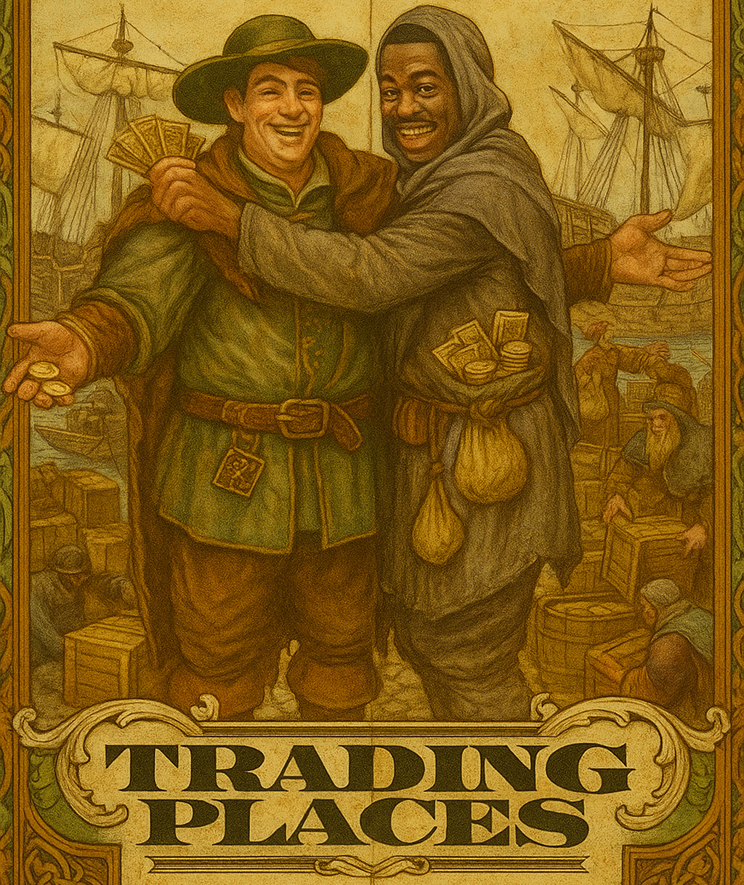
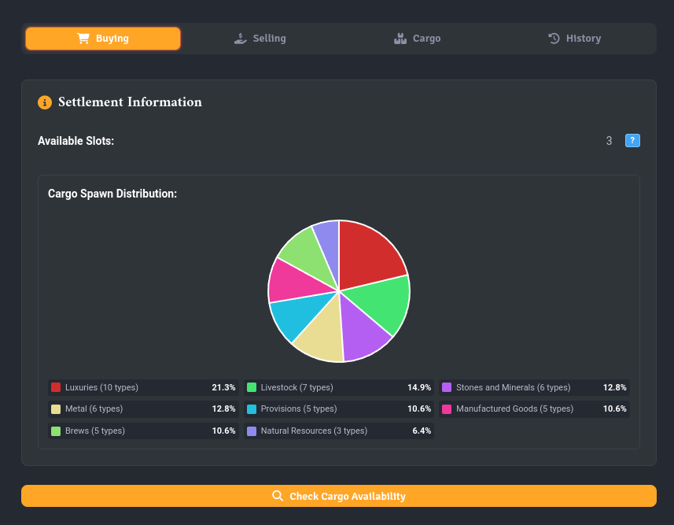
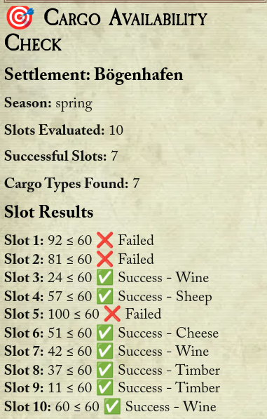
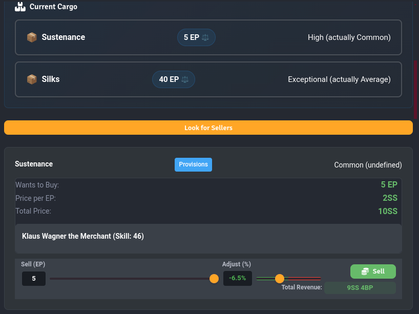

# Trading Places

A river trading tool for FoundryVTT that helps you buy and sell cargo, manage inventory, and handle market transactions.

## Features

- **A complete trading system for Foundry**: Based on Warhammer Fantasy Roleplay river trading
- **Buying and selling**: buy/sell cargo across settlements, haggle with merchants,and manage your boat's cargo.
- **Settlement goods simulation**: Each settlement stocks different goods based on its size, population, and what the region produces.
- **Complex pricing system**: The price of goods changes with the season and current supply and demand.
- **Cargo management**: Track what your boat is carrying, its quality and encumbrance.
- **Custom world building**: Built for Warhammer Fantasy Roleplay, but designed to work with any system or setting. Bring your own settlements, cargo types, and currencies, or use the included Reikland dataset.

## Screenshots

| Cargo Availability | Goods Distribution | Selling Cargo |
| :---: | :---: | :---: |
|  |  |  |
| *Cargo Availability* | *Goods Distribution* | *Selling Cargo* |

## Installation

1. In FoundryVTT, navigate to the **Add-on Modules** tab.
2. Click **Install Module**.
3. Paste the manifest URL: `https://raw.githubusercontent.com/orangebutblue/trading-places/refs/heads/main/module.json`
4. Click **Install** and enable the module in your world.

## Usage

1. Enable the module in your FoundryVTT world.
2. Configure the current season and dataset in module settings.
3. Access the trading interface through the scene controls or GM menu.
4. Conduct transactions with real-time equilibrium updates and chat logging.

## Configuration

- **Active Dataset**: Switch between different trading datasets (e.g., `wfrp4e`).
- **Season Management**: Set current season for price variations.
- **Merchant Settings**: Adjust generation parameters, personality traits, and dishonesty chance.
- **Chat Visibility**: Configure who sees trading results and dice rolls.

## Planned Features

- Merchant generation (procedurally generated merchants with, backgrounds, personalities, and haggling skills)
- Mission System / Rumors
- Dynamic prices (selling a cargo reduces its price)

## Requirements

- FoundryVTT v12 or higher
- Compatible with WFRP4e system (optional, for enhanced integration)

## License

This module is licensed under the MIT License.
