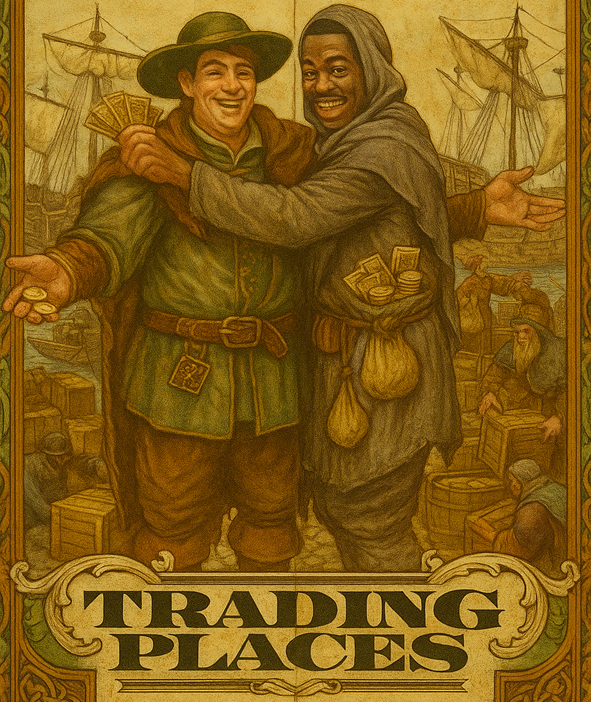

# Trading Places

A comprehensive FoundryVTT for river trading, featuring modern UI, advanced merchant systems, and dynamic market mechanics.

## Features

- **Complete WFRP4e Trading Implementation**: Full adherence to the official WFRP 4E trading algorithm (pages 71-78) with orange-realism enhancements
- **Modern User Interface**: Responsive trading dialog with supply/demand visualization, merchant personality displays, and transaction management
- **Advanced Merchant System**: Population-based merchant generation with skill distribution, behavioral traits, and special abilities
- **Equilibrium Mechanics**: Dynamic supply/demand ratios affecting availability, pricing, and merchant desperation
- **Data Management Tools**: Built-in editors for settlements, cargo types, and trading configurations with real-time validation
- **Seasonal Dynamics**: Market variations based on seasons with configurable price modifiers
- **Haggling System**: Skill-based negotiation mechanics with dice rolling integration
- **Settlement-Based Trading**: Cargo availability and buyer mechanics tied to settlement characteristics
- **FoundryVTT Integration**: Native dice rolling, chat messages, and GM-configurable settings
- **Dataset Flexibility**: System-agnostic design supporting multiple trading datasets
- **Comprehensive Testing**: Full test suite with automated validation and integration scenarios

## Installation

1. In FoundryVTT, navigate to the **Add-on Modules** tab
2. Click **Install Module**
3. Paste the manifest URL: `https://raw.githubusercontent.com/orangebutblue/trading-places/refs/heads/main/module.json`
4. Click **Install** and enable the module in your world

## Usage

1. Enable the module in your FoundryVTT world
2. Configure the current season and dataset in module settings
3. Access the trading interface through the scene controls or GM menu
4. Conduct transactions with real-time equilibrium updates and chat logging
5. Use the data management UI to customize settlements and cargo types

## Configuration

- **Active Dataset**: Switch between different trading datasets (e.g., `wfrp4e` for WFRP4e compatibility)
- **Season Management**: Set current season for price variations
- **Chat Visibility**: Configure who sees trading results and dice rolls
- **Merchant Settings**: Adjust generation parameters and personality traits

## Planned Features

- Settlement Management UI
- Cargo Type Management UI
- Mission System / Rumors
- Dynamic prices (selling a cargo reduces its price)

## Requirements

- FoundryVTT v13 or higher
- Compatible with WFRP4e system (optional, for enhanced integration)

## License

This module is licensed under the MIT License.